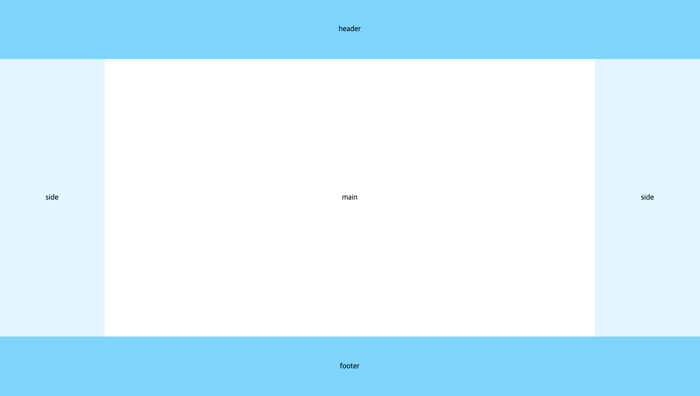

# 1주차 과제 - Layout

## 🚀 요구 사항

- 하단에 첨부된 사진과 동일한 Layout을 각각 `inline-block`, `flex`, `grid` 속성을 사용해 개발한다.
- header와 footer의 색상 코드는 ` #5ed7ff`, side의 색상 코드는 `#dff3fd`이다.
- header와 footer의 height는 동일하게, side의 width는 동일하게 설정한다.
- 주어진 파일 내에 이미 존재하는 소스 코드들은 수정하지 않고 진행한다.

## ⭐️ 과제 진행 및 제출

- [FE-STUDY](https://github.com/FX-STUDY/FE-STUDY) 저장소를 Fork & Clone한 뒤, 개인 branch를 생성해 미션을 진행한다.
- [커밋 메시지 컨벤션](https://gist.github.com/stephenparish/9941e89d80e2bc58a153) 가이드를 참고해 커밋 메시지를 작성한다.
