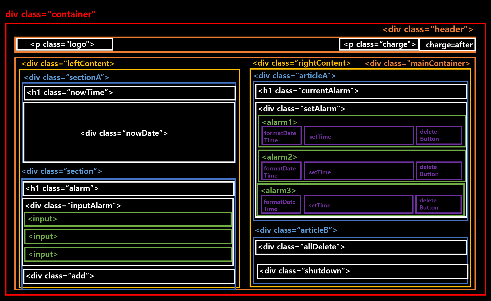
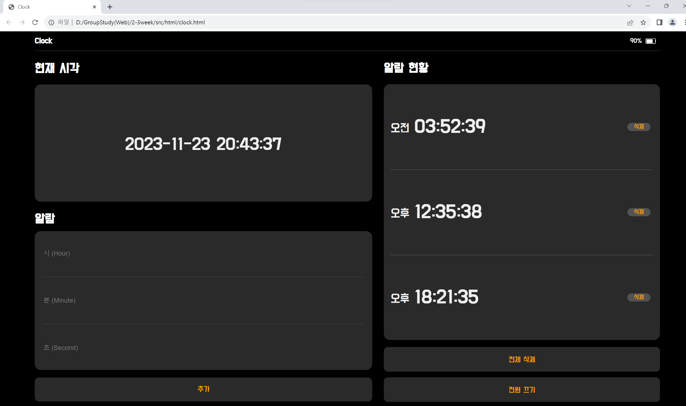

# 🚀 2주차 - DOM 구조 

## 🔑 각 클래스에서 하는 역할 및 배치
- **div class="container"**  
  전체 div 요소들을 묶는 컨테이너입니다. 전체 요소들의 가장 부모 요소로, 전체 컨테이너의 너비, 높이 및 display 속성을 flex로 고정합니다. (폰트도 지정)
  > 전체 너비 : 100vw, 전체 높이 : 100vh

    

- **div class="header"**  
  헤더 영역을 지정하는 div 클래스입니다. header 클래스 안 아이템 요소들은 flex 방향을 가로로 배치하게 지정합니다. 또한 아이템 요소들이 일정한 간격을 두고 멀어지게 배치하기 위해 `justify-content: space-between;`속성을 추가할 예정입니다. 
  > 전체 너비 : 90vw, 전체 높이 : 5vh

    

- **p class=logo**  
  Clock 텍스트가 들어갈 부분입니다.  
  > header의 Clock: color - #fff / size - 20px / weight - bold

    

- **p class=charge**  
  충전량에 관한 텍스트가 들어갈 부분입니다.  
  > header의 battery 잔량: color - #fff / size - 16px  
  > `after 생성자` : battery 이미지를 넣기 위한 가상 생성자를 추가 

    

- **div class="mainContainer"**  
  leftContent/rightContent 요소들을 묶는 컨테이너입니다. 해당 요소들의 부모 요소로, leftContent/rightContent 요소들의 너비, 높이 및 display 속성을 flex로 고정합니다.  
  `flex 방향을 row`로 하여 leftContent/rightContent 클래스가 `가로 방향으로 배치`되게 설정합니다.
  > 전체 너비 : 90vw, 전체 높이 : 95vh  
  > `after 생성자` : 구분선을 넣기 위한 가상 생성자를 추가 (top 속성을 써서 header 밑에 구분선 배치) 

    

---
  

- **div class="leftContent"**  
  leftContent요소들을 묶는 클래스입니다.  현재 시각 + 알람(input) 요소들을 묶는 부모 요소로, 전체 너비, 높이 및 display 속성을 flex로 고정합니다.  
  `flex 방향을 column`로 하여 요소들이 `세로 방향으로 배치`되게 설정합니다.
  > 전체 너비 : 55vw, 전체 높이 : 95vh  

    

- **div class="sectionA"**  
  현재시각을 나타내는 h1 텍스트와 숫자 요소들을 묶는 클래스입니다. 전체 95vh 높이에서 40%만 차지합니다. 또한  `flex 방향을 column`로 하여 요소들이 `세로 방향으로 배치`되게 설정합니다.
    

- **h1 class="nowTime"**  
  현재시각을 나타내는 h1 텍스트 클래스입니다. sectionA 클래스 높이에서 10%의 높이만 차지합니다. flex를 선언해 텍스트가 block 처리되지 않게 합니다.  
  `align-items: flex-end;`를 사용해 아이템 요소가 bottom에 붙게 처리합니다. 
    

- **p class="nowDate"**  
  과제를 시작한 현재 시각을 나타내는 p 텍스트 클래스입니다.  sectionA 클래스 높이에서 85%의 높이만 차지합니다. flex를 선언해 텍스트가 block 처리되지 않게 합니다.  
  > `justify-content: center; align-items: center;`를 사용해 아이템 요소가 정가운데에 정렬되게 처리합니다.  
  > `background-color: #2a2a2a;, border-radius: 15px;` 속성을 넣어 회색 둥근 사각형 ui를 추가합니다. 

    

- **div class="sectionB"**  
  알람 h1텍스트와 input 요소들을 묶는 클래스입니다. 전체 95vh 높이에서 55%만 차지합니다. 또한  `flex 방향을 column`로 하여 요소들이 `세로 방향으로 배치`되게 설정합니다.
    

- **h1 class="alarm"**  
  알람 예약 h1 텍스트 클래스입니다. sectionB 클래스 높이에서 13%의 높이만 차지합니다. flex를 선언해 텍스트가 block 처리되지 않게 합니다.  
  `align-items: flex-end;`를 사용해 아이템 요소가 bottom에 붙게 처리합니다. 
    

- **div class="inputAlarm"**  
  알람 예약 input 3개를 묶어놓은 클래스입니다. sectionB 클래스 높이에서 70%의 높이만 차지합니다. flex를 선언해 텍스트가 block 처리되지 않게 합니다.  
  > `justify-content: center; align-items: center;`를 사용해 아이템 요소가 정가운데에 정렬되게 처리합니다.  
  > `background-color: #2a2a2a;, border-radius: 15px;` 속성을 넣어 회색 둥근 사각형 ui를 추가합니다. 

    

- **input**  
  각 input 요소 하나당 적용되는 속성들입니다. inputAlarm 클래스 높이에서 각 32% 차지하게 하였고, `flex:1;` 속성을 통해 아이템들의 너비가 전체 너비에 1:1:1로 자동 맞춤되게 설정합니다.  `placeholder`를 사용해 input 텍스트의 hint 속성을 부여합니다.  
  > `justify-content: flex-start;`를 사용해 아이템 요소 왼쪽 정렬  
  > `align-items: center;`를 사용해 아이템 중앙 배치   
  > `background-color: transparent;`를 사용해 input에 default background 컬러를 삭제합니다. 

    

- **div class="add"**  
  알람 추가 버튼에 대한 div 클래스입니다. sectionB 클래스 높이에서 12%의 높이만 차지합니다. `flex` 및 `justify-content: center; align-items: center;`를 사용해 아이템 요소가 정가운데에 정렬되게 처리합니다.  
  > `background-color: #2a2a2a;, border-radius: 10px;` 속성을 넣어 회색 둥근 사각형 ui를 추가합니다.  
  > `color: #f69906;`를 줘서 텍스트 컬러를 노랑색으로 변경해줍니다.

    

---
  

- **div class="rightContent"**  
  rightContent요소들을 묶는 클래스입니다. 알람 현황 + 버튼 2개 요소들을 묶는 부모 요소로, 전체 너비, 높이 및 display 속성을 flex로 고정합니다.  
  `flex 방향을 column`로 하여 요소들이 `세로 방향으로 배치`되게 설정합니다.
  > 전체 너비 : 45vw, 전체 높이 : 95vh  

    

- **div class="articleA"**  
  알람 현황 요소들을 묶는 클래스입니다. 너비 45vw, 높이는 rightContent 높이 95vh의 80%를 차지합니다. `flex 방향을 column`로 하여 요소들이 `세로 방향으로 배치`되게 설정합니다.
    

- **h1 class="currentAlarm"**  
  알람 현황 h1 텍스트 클래스입니다. articlaA 클래스 높이에서 7%의 높이만 차지합니다. flex를 선언해 텍스트가 block 처리되지 않게 합니다.  
  `align-items: flex-end;`를 사용해 아이템 요소가 bottom에 붙게 처리합니다. 
    

- **div class="setAlarm"**  
  alarm1, alarm2, alarm3 div 클래스 세개를 묶어 놓은 부모 클래스입니다. articlaA 클래스 높이에서 88%의 높이만 차지합니다. `flex 방향을 column`로 하여 요소들이 `세로 방향으로 배치`되게 설정합니다.
  > `background-color: #2a2a2a;, border-radius: 15px;` 속성을 넣어 회색 둥근 사각형 ui를 추가합니다.

    

- **div class="alarm1", div class="alarm2", div class="alarm3"**  
  `flex:1;` 속성을 통해 아이템들의 너비가 전체 너비에 1:1:1로 자동 맞춤되게 설정합니다.  
  `align-items: center;`를 사용해 아이템 요소가 중앙에 배치되게 처리합니다. 
    

- **.alarm2::after, .alarm3::after**  
  `after` 가상 생성자 속성을 통해 구분선 생성을 합니다. top 속성을 사용해 각 클래스 top 부분에 구분선이 생성되게 처리합니다.  
    

- **p class="formatDateTime"**  
  오전/오후 텍스트에 대한 클래스입니다. 각 alarm1, alarm2, alarm3 클래스 안에 공통으로 들어가는 클래스로 각 클래스 너비의 9% 너비를 차지합니다. 
    

- **p class="setTime"**  
  예약한 시간 텍스트에 대한 클래스입니다. 각 alarm1, alarm2, alarm3 클래스 안에 공통으로 들어가는 클래스로 각 클래스 너비의 50% 너비를 차지합니다. 
    

- **div class="deleteButton"**  
  삭제 버튼의 부모 클래스입니다. 각 alarm1, alarm2, alarm3 클래스 안에 공통으로 들어가는 클래스로 각 클래스 너비의 40% 너비를 차지합니다. `justify-content: flex-end;` 속성을 사용해 아이템 요소들이 오른쪽 정렬되게 합니다. 
    

- **p class="delete"**  
  삭제 버튼에 대한 클래스입니다. 각 alarm1, alarm2, alarm3 클래스 안에 공통으로 들어가는 클래스로 deleteButton 너비의 22% 너비를 차지합니다. 
  > `justify-content: center;, align-items: center;` : 아이템 요소들이 중앙 정령 되게 설정  
  > `background-color: #535353;, border-radius: 15px;` : 삭제 텍스트 주변에 연회색 둥근 사각형 ui 설정

    

- **div class="articleB"**  
  전체 삭제 + 전원 끄기 요소들을 묶는 클래스입니다. 너비 45vw, 높이는 rightContent 높이 95vh의 20%를 차지합니다. `flex 방향을 column`로 하여 요소들이 `세로 방향으로 배치`되게 설정합니다.
  > `align-items: flex-start;` : 각 아이템 요소들을 위쪽 정렬 

    

- **div class="allDelete", div class="shutdown"**  
  전체 삭제,  전원 끄기 요소들 각각에 대한 클래스입니다. 너비 45vw, 높이는 articleB 높이의 34%를 차지합니다. 
  > `justify-content: center;, align-items: center;` : 각 아이템 요소들을 중앙 정렬  
  > `margin-bottom: 1.5vh;` : 각 아이템 바텀 영역을 1.5vh 띄움
  > `background-color: #2a2a2a;, border-radius: 10px;` : 둥근 사각형 ui 설정

  
  
 # 🚀 3주차 - 완성된 Clock UI 
