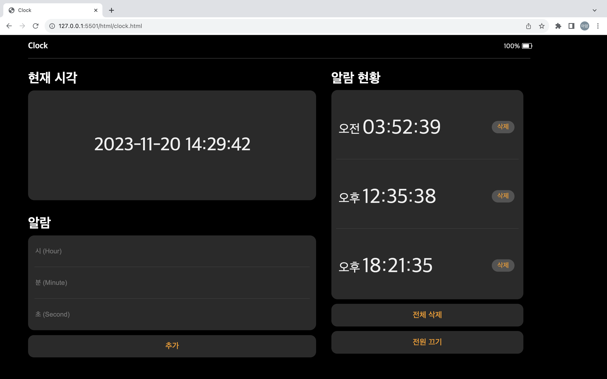

# 3주차 과제 - 간단한 시계 UI

## 🚀 요구 사항

- 2주차 과제를 README에 첨부하고, 해당 과제를 기반으로 DOM 요소를 배치한다. 단, `flex` 속성만 사용해 구현한다.
- 헤더에는 `assets` directory에 있는 battery.png 파일을 사용해 배터리 잔량을 표시한다. 단, 배터리 이미지는 `::after` 가상 선택자를 사용한다.
- 헤더와 메인이 구분될 수 있도록 구분선을 표시한다. 단, 구분선은 `::after` 가상 선택자를 사용한다.
- 현재 시각에는 본인이 과제를 시작한 날짜를 작성한다. (e.g. 2023-11-20 14:29:42)
- 알람은 총 세 개의 `input`으로 구성되어 있으며, `placeholder`를 사용해 글씨가 나타날 수 있도록 한다.
- 알람 현황은 총 세 개의 `div` 박스로 구성되도록 한다.
- 위 요구 사항을 명시되어 있지 않은 것들은 본인의 판단대로 구현된 UI 사진을 참고하여 과제를 진행한다.

## 🎨 UI 속성

- header의 Clock: color - `#fff` / size - `20px` / weight - `bold`
- header의 battery 잔량: color - `#fff` / size - `16px` (default 값이니 별도로 지정하지 않아도 됨)
- 헤더 및 알람, 알람 현황 구분선: 선 굵기 - `1px` / color - `#4a4a4a`
- 각 Title(현재 시각, 알람, 알람 현황): color - `#fff` / `<h1>` 태그 사용
- 현재 시각 컨테이너 내의 시각: color - `#efefef` / size - `45px` / weight - `500`
- input placeholer: size - `16px` (default 아님)
- 버튼, 컨테이너: color - `#2a2a2a` / weight - `500`
- 버튼 text: color - `#f69906` / size: `19px` / weight - `500`
- 알람 현황 내 오전 오후 text: color - `#efefef` / size - `30px`
- 알람 현황 내 시간 text: color - `#efefef` / size - `50px`
- 알람 현황 내 삭제 버튼: color - `#535353` / size - `16px` (default 아님)

## ⭐️ 과제 진행 및 제출

- [FE-STUDY](https://github.com/FX-STUDY/FE-STUDY) 원격 저장소를 Fork한 Repository를 Update한 뒤 2주차 & 3주차 폴더에서 과제를 진행한다.
- [커밋 메시지 컨벤션](https://gist.github.com/stephenparish/9941e89d80e2bc58a153) 가이드를 참고해 커밋 메시지를 작성한다.
