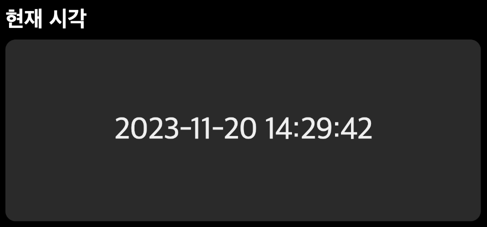
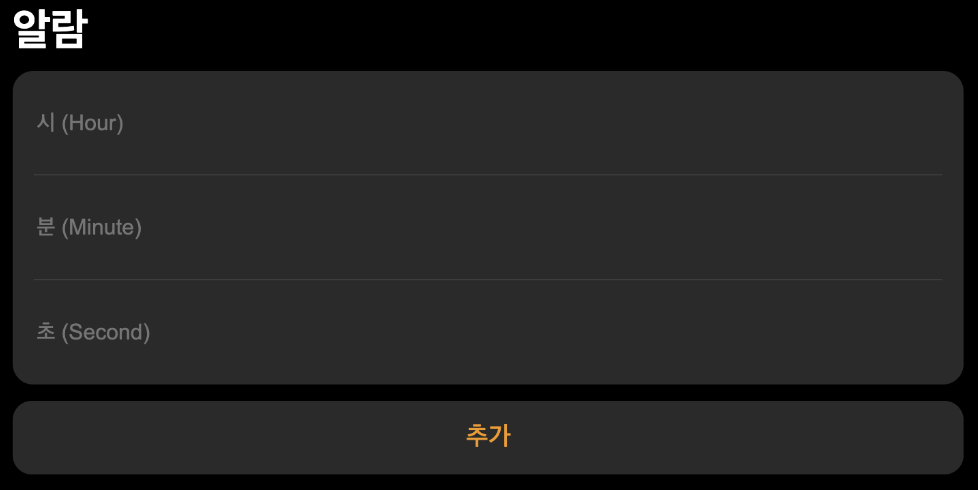
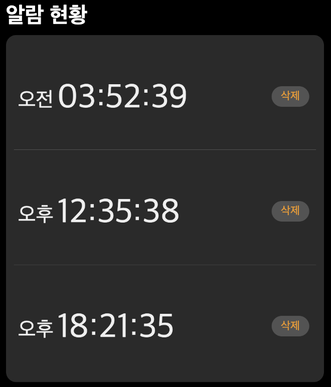

# 4주차 과제 - 간단한 시계 기능

## 🚀 요구 사항

3주차 과제를 기반으로 간단한 시계 기능을 구현한다. 4주차 미션 디렉터리의 `clock.js`가 완성되면 3주차 미션의 `clock.html`에서 외부 스크립트인 `clock.js`를 참조할 수 있도록 한다. 전체적으로 완성된 UI는 아래 사진과 같다.

### 🔋 배터리 구현

- [x] 배터리는 1초에 1씩 감소하도록 구현한다. (초기값 100)
- [x] 배터리가 0이 될 경우 현재 시각이 더 이상 나타나지 않도록 한다.
- [x] 배터리가 0이 될 경우 현재 시각의 회색 박스 색깔을 `#111`로 변경한다.

### 🕐 현재 시각

- [x] 현재 시각은 한국 표준시가 나타나도록 구현한다. (시간 형식 YYYY-MM-DD hh:mm:ss)

### ⏰ 알람 추가

- [x] 시(Hour)에 0 미만 23 초과 숫자가 입력될 시 `alert`로 경고 메시지를 보여 준다.
- [x] 시 입력 시, 0에서 11까지는 오전, 12에서 23까지는 오후로 표기되도록 구현한다.
- [x] 분(Minute)에 0 미만 59 초과 숫자가 입력될 시 `alert`로 경고 메시지를 보여 준다.
- [x] 초(Second)에 0 미만 59 초과 숫자가 입력될 시 `alert`로 경고 메시지를 보여 준다.
- [x] 추가 버튼 클릭 시 알람 현황에 알람이 추가될 수 있도록 구현한다.

### ⏰ 알람 현황

- [x] 우측의 삭제 버튼을 누를 경우 해당 알람이 삭제되도록 구현한다.

### 🛠️ 전체 삭제

- [x] 전체 삭제 버튼을 누를 경우 알람 현황의 모든 알림이 삭제되도록 구현한다.
- [x] 알람이 모두 삭제되면 아무것도 없는 회색 박스만 남아 있도록 한다.

### 🔌 전원 끄기

- [x] 전원 끄기 버튼을 누를 경우 현재 시각이 더 이상 나타나지 않도록 구현한다.
- [x] 전원 끄기 버튼을 누를 경우 회색 박스의 색깔을 `#111`로 변경한다.

## ⭐️ 과제 진행 및 제출

- [FE-STUDY](https://github.com/FX-STUDY/FE-STUDY) 원격 저장소를 Fork한 Repository를 Update한 뒤 4주차 디렉터리에서 과제를 진행한다.
- [커밋 메시지 컨벤션](https://gist.github.com/stephenparish/9941e89d80e2bc58a153) 가이드를 참고해 커밋 메시지를 작성한다.
